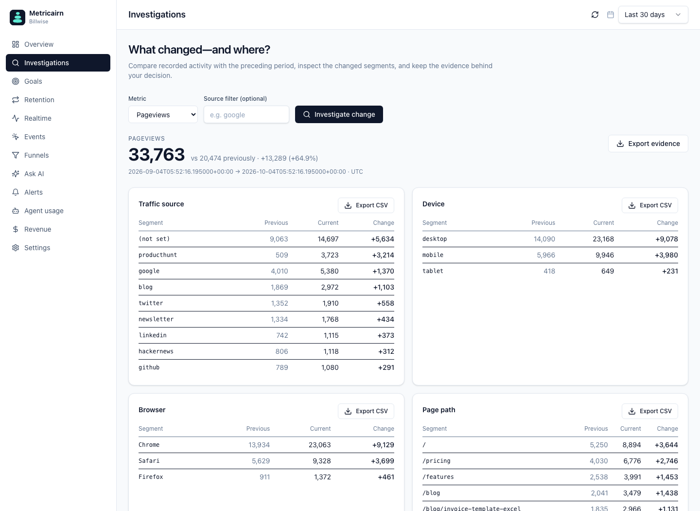

# Metricairn

**Open-source, self-hosted product analytics with an MCP server.**

Track traffic, signups, and returning visitors. Investigate changes from your dashboard or AI agent, inspect query windows and collection coverage, and save reports with separate review notes.



*Simulated Billwise data.*

## What you get

- Traffic, realtime activity, custom events, ordered funnels, conversion goals, and weekly retention.
- Filtered queries and change investigations with segment contributions, coverage checks, timeline context, and evidence export.
- Immutable saved reports with separate review status and notes.
- 20 MCP tools for discovery, queries, investigations, and questions; three opt-in management tools. Structured analytics work without an AI provider.
- A browser tracker with SPA navigation, bounded retries, deduplication, query cleanup, and DNT/GPC controls.
- Scoped keys, credential rotation, project-data deletion, and optional alerts and digests.

## Start

```bash
git clone https://github.com/rnepal2/metricairn.git
cd metricairn
docker compose up --build
```

Open **http://localhost:8000**, create a project, and save the three keys shown once. The container serves the dashboard, API, and tracker; SQLite data persists in a named volume. No account, cloud service, or AI key required. For source development, see [CONTRIBUTING](CONTRIBUTING.md).

Install the tracker on your site:

```html
<script defer src="https://YOUR-HOST/static/metricairn.js"
  data-api="https://YOUR-HOST/api/v1/ingest" data-key="alw_YOUR_TRACKING_KEY"></script>
```

Track a meaningful action with `window.metricairn.event('signup')`, then define it as a goal in the dashboard. HTTPS and a reachable deployment are required for a real site; the local container binds to loopback. See [deployment](docs/operations.md).

## Connect an agent

With the API running, install the local MCP connector in the same checkout. This step requires [uv](https://docs.astral.sh/uv/getting-started/installation/) and Python 3.12; uv can install Python automatically. Node and Make are not required for the Docker setup.

```bash
uv sync --locked --no-dev
```

Configure a client that supports stdio, replacing the absolute path and project read key:

```json
{
  "mcpServers": {
    "metricairn": {
      "command": "/ABSOLUTE/REPO/.venv/bin/python",
      "args": ["-m", "metricairn_mcp"],
      "env": {
        "METRICAIRN_API_URL": "http://localhost:8000",
        "METRICAIRN_READ_KEY": "alr_YOUR_READ_KEY"
      }
    }
  }
}
```

Try: **“Investigate signup changes over the last week. Check collection coverage, show the largest changed segments, and separate observations from hypotheses.”**

The connector queries your running API. `ask` stores question history and may use an API-side AI provider if configured; tool-call telemetry is optional. [MCP setup and tool reference](docs/mcp.md).

## Billwise example

Maya Chen, the fictional founder of an invoicing app, investigates campaign signups, conversion, and returning visitors. Follow copyable calls and results from simulated data, then replay them through a real MCP session. [Walkthrough and demo setup](docs/use-cases/billwise.md).

## Scope

Metricairn is a lightweight, self-hosted product analytics platform with an MCP server for small teams. Deployments are operator-managed, without hosted user accounts or OAuth. Cookieless tracking uses browser-local identifiers; retention measures first-observed visitors, not verified people. Production scale and recovery depend on your deployment. [Metric definitions](docs/trust-and-data.md) · [Security](SECURITY.md).

[API](docs/api.md) · [Architecture](docs/architecture.md) · [Roadmap](docs/roadmap.md) · [Product direction](docs/strategy.md)

[MIT licensed](LICENSE). Contributions are welcome; see [CONTRIBUTING](CONTRIBUTING.md).
