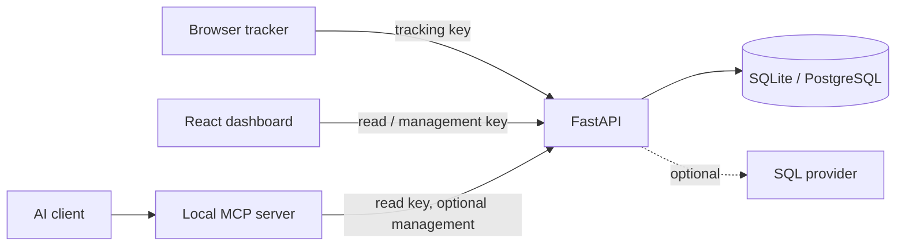

# Architecture

| Path | Responsibility |
|---|---|
| `apps/api` | Collection, semantic queries, goals, cohorts, investigations, administration |
| `apps/web` | React/TypeScript dashboard and simulated demo |
| `apps/mcp-server` | Typed tools using the same API |
| `packages/tracker` | Browser tracking IIFE and contract tests |
| `skills/metricairn-analytics` | Agent workflow and connection example |
| `scripts` | Demo seeding, local export, credential recovery |
| `tests/e2e` | Desktop/mobile product journeys |

Core aggregates execute in SQL. Referrer normalization, ordered funnels, and weekly retention stream or retain identity state; these are intended for small deployments, not demonstrated high-volume operation. Investigations use grouped event counts and a versioned query plan. Saved JSON evidence is immutable through the API; review decisions are stored separately. Its hash identifies the report payload, not a signed or tamper-proof raw-data snapshot.

SQLite is the zero-service default; PostgreSQL uses `DATABASE_URL`. Startup creates new tables and adds missing nullable columns/indexes. Breaking schema changes require explicit migrations. The container serves built web assets and tracker alongside the API; Vite is development-only. Alerts/digests are opt-in, with one scheduler per database.
