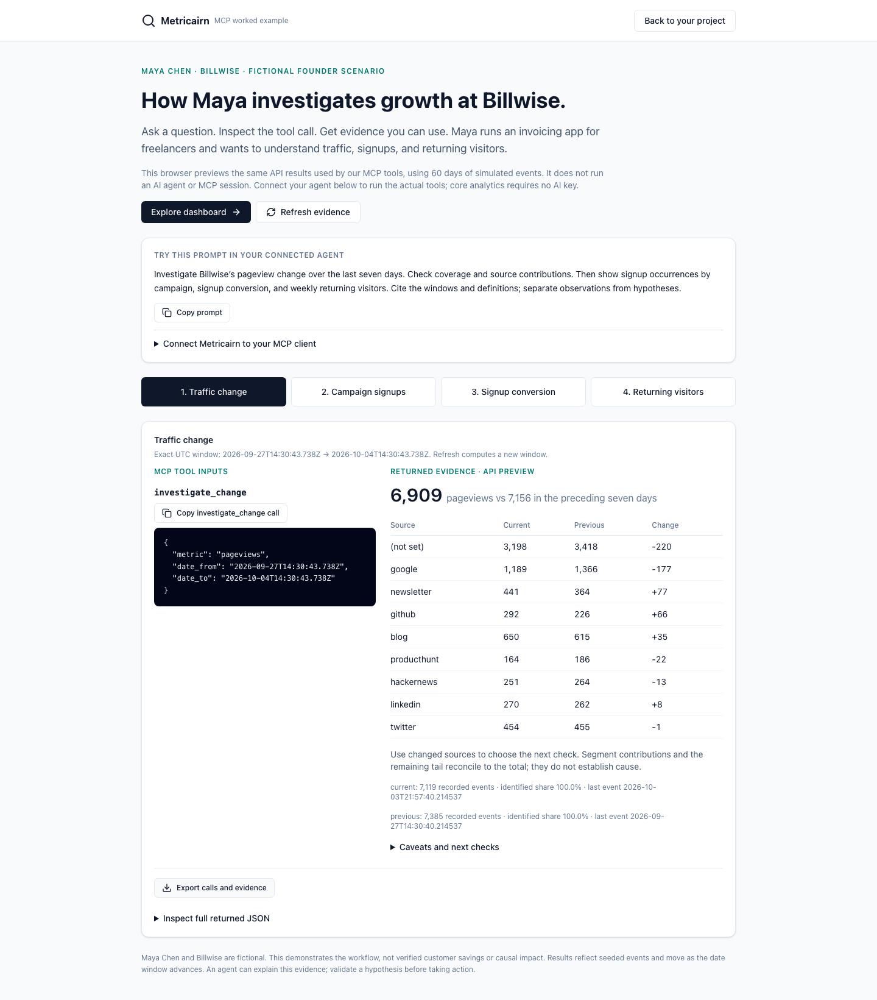

# Maya Chen at Billwise

**Fictional MCP worked example.** Maya is the solo founder of Billwise, an invoicing app for freelancers. The browser shows copyable tool arguments, live API results, metric definitions, and full JSON from simulated events. It previews the same API used by MCP; it does not run an agent or MCP session. No customer endorsement or measured business outcome is claimed.



## Monday’s questions

| Question | MCP calls | What you get |
|---|---|---|
| What changed this week? | `investigate_change` | Equal-duration comparison, segment contributions, collection coverage, caveats, next checks |
| Which campaigns have signup activity? | `run_query` with `event_count`, `signup`, and `utm_campaign` | Occurrence counts, including repeats and missing tags; association, not causal ROI |
| Are visitors converting? | `list_goals` → `goal_report` using the returned signup goal ID | Distinct conversions, pageview denominator, repeat occurrences, missing identity |
| Do visitors return? | `retention_report` | First-observed weekly cohorts; incomplete weeks stay blank |

Example agent request: “Investigate Billwise’s pageview change over the last seven days. Check collection coverage, show the largest changed segments, and give me the next checks. Then report signup conversion and returning visitor cohorts.” The MCP server uses the same API definitions as the dashboard.

## Run the example

From a source checkout, with Python 3.12, Node.js 22, uv, and Make:

```bash
make setup
make build
make api                         # leave running in terminal 1
uv run python scripts/seed_billwise.py  # terminal 2, same repository root/database
```

Open **http://localhost:8000/?demo=billwise**, or select **“Explore the simulated Billwise demo”** on the login screen. Select an example to see its inputs and results, inspect full JSON, or export the calls and evidence. The connection panel includes an MCP client configuration and a prompt. “Explore dashboard” connects with read access. Seeding replaces only the existing public demo project. Never use its shared read key for real customer data.

Verify the actual protocol without an AI provider:

```bash
uv run python scripts/demo_mcp.py --output output/billwise-mcp.json
# Replay the exact arguments from a browser evidence export:
uv run python scripts/demo_mcp.py --replay /path/to/metricairn-billwise-evidence.json
```

The script starts a real stdio MCP session, runs the five read-only tools above, and emits their actual arguments and returned JSON. It uses only the public demo read key and does not inherit management or tracking credentials. Exact windows are preserved on replay; counts can still change if events are added or the fixture is reseeded.

The dataset includes traffic sources/campaigns, repeat visitors, signup events, an ordered funnel, an Account signup goal, and timeline notes. Existing recorded-payment events remain optional historical context; this walkthrough requires no payment integration. For agent access, use the [MCP configuration](../../README.md#connect-an-agent) with demo read key `alr_bw_demo_9f2k7q4x1m8z3d6v`.

## Boundaries

A missing source tag is visible as `(not set)`. Goal conversion uses visitors with a pageview followed by signup; repeat signup events count once per visitor. Retention uses first recorded activity and leaves incomplete weeks blank. Nearby timeline notes do not establish cause. Saving a fixed query freezes its newly computed evidence; later activity does not rewrite the record. See [metric definitions](../trust-and-data.md).
